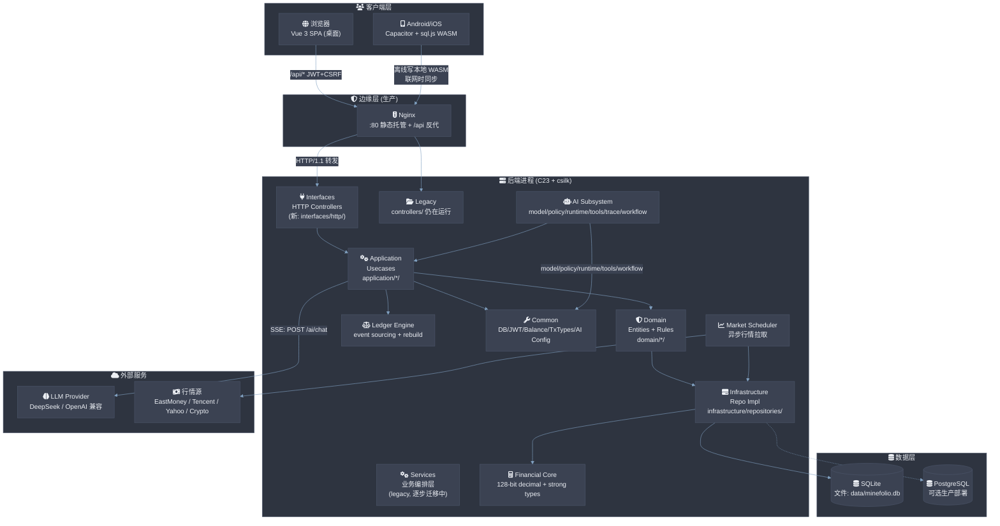
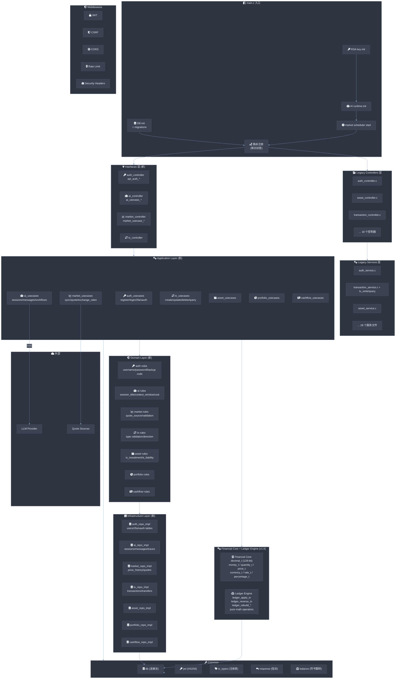
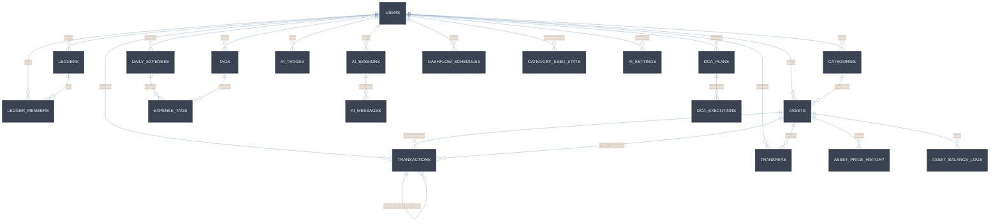
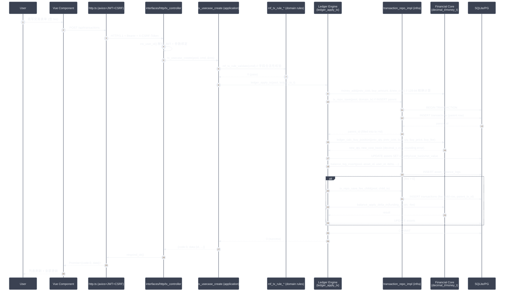
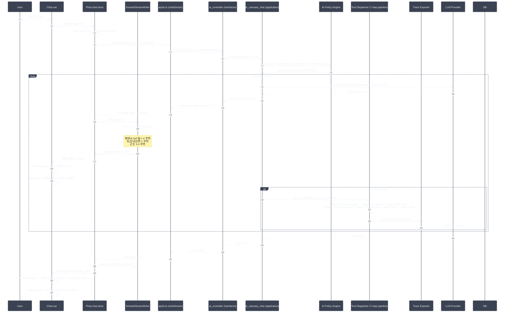
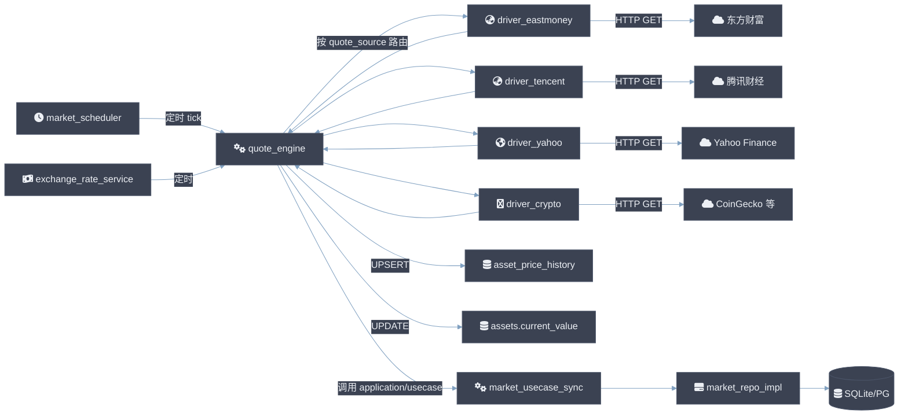
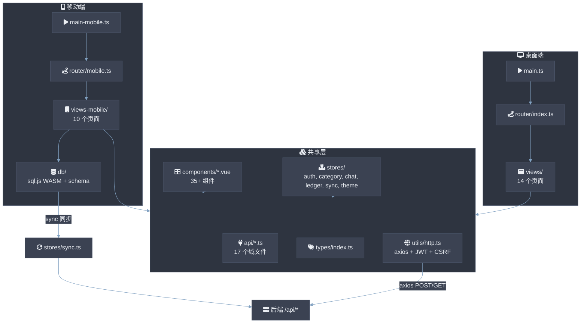
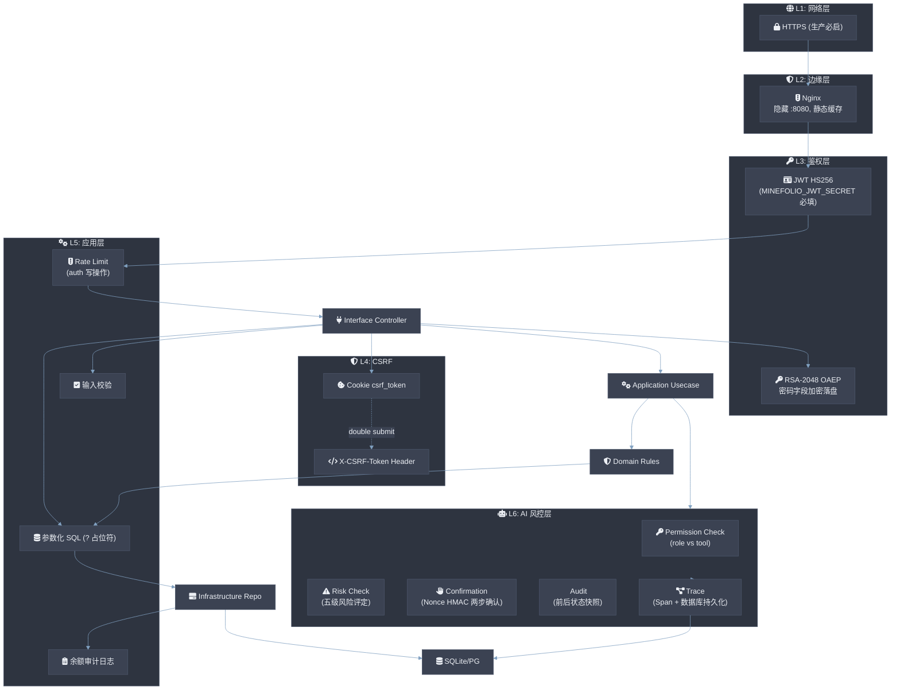

# Minefolio — 架构与设计说明书 (Architecture & Design Specification)

> 版本: 2026-09-03 v1.1  
> 适用范围: 仓库 HEAD (`master` 分支)  
> 受众: 研发、运维、安全审计、二次开发

---

## 0. 摘要 (TL;DR)

Minefolio 是一个**自托管的个人财务与投资追踪平台**,支持多账户类型(现金、银行、信用卡、贷款)、多资产持仓(股票/基金/债券/加密货币,含完整成本基础与盈亏)、AI 对话式记账、定投(DCA)计划、被动现金流台账、多账本协作与 CSV 导入导出。**后端采用 C23 + csilk v0.5.2 HTTP 框架 + 分层架构 (Domain/Application/Infrastructure/Interfaces) + 128 位定点 Financial Core + 事件溯源 Ledger Engine**;**前端采用 Vue 3 + TypeScript SPA**;**移动端使用 Capacitor + sql.js WASM 完全离线运行**。本文档按"总-图-分"黄金法则,从物理拓扑、模块分解、数据模型、关键数据流、部署拓扑、安全边界六个维度给出完整工程级架构说明。

---

## 1. 系统整体架构

### 1.1 总 (Overview)

Minefolio 采用**经典三层 B/S 架构 + 四层 C 后端分层 + 离线移动子端**。HTTP 层(Interface Controllers)只做协议解析与响应封装,应用层(Usecases)负责用例编排,领域层(Domain)定义纯业务规则与实体契约,基础设施层(Infrastructure)实现仓储契约。Financial Core 提供 128 位定点高精度金融数学与强类型领域模型;Ledger Engine 作为统一账本核心,实现事件溯源与状态重算。前端 Vue 3 SPA 桌面端通过 nginx 反向代理与 C 后端通信,移动端通过 Capacitor WebView 加载同一份 dist-mobile 产物,并使用内嵌的 sql.js WASM 在本地 SQLite 中完全离线工作。AI 子系统(DeepSeek/OpenAI 兼容)通过 Server-Sent Events 流式输出,经两层缓冲区(网络→SSE→RAF type-writer)实现平滑打字效果。

### 1.2 图 (Diagram)



### 1.3 分 (Breakdown)

| 组件 | 职责 | 关键文件 |
|------|------|----------|
| **Vue 3 SPA (桌面)** | 单页应用,Vue Router + Pinia,Element Plus UI,本地无状态 | `frontend/src/main.ts`、`router/index.ts` |
| **Capacitor Mobile** | 同一份 API 层,内嵌 sql.js WASM 做离线 SQLite,Android 端走 Gradle | `frontend/src/main-mobile.ts`、`vite.config.mobile.ts` |
| **Nginx** | 静态托管 `frontend/dist` + `/api/*` 反代到 `:8080` | `nginx/nginx.conf` |
| **Interfaces Layer** | **新架构**: 纯委托型 HTTP Controllers,仅做参数提取 + 调用 usecase + 响应封装 | `backend/src/interfaces/http/controllers/` |
| **Legacy Controllers** | **过渡期保留**: 原 `controllers/*_controller.c`,仍注册路由运行中 | `backend/src/controllers/` |
| **Application Layer** | **新架构**: 每个域一个 Use Case 模块,编排领域规则 + Financial Core + Ledger Engine | `backend/src/application/*/{commands,dtos,usecases}.h/.c` |
| **Domain Layer** | **新架构**: 纯业务实体、仓储契约接口、业务规则;零外部依赖 | `backend/src/domain/*/{entity,repository,rules}.{h,c}` |
| **Infrastructure Layer** | **新架构**: 实现 Domain Repository 契约,执行 SQL,返回领域实体 | `backend/src/infrastructure/repositories/*_repo_impl.c` |
| **Business Services (legacy)** | 业务编排层(仍在运行,待迁移至 Application Layer) | `backend/src/services/*` |
| **Financial Core** | **新增 v1.0**: 128 位定点高精度金融数学 + 强类型领域模型 | `backend/src/core/financial/` |
| **Ledger Engine** | **新增 v1.0**: 事件溯源账本,原子 `ledger_apply_tx` / `ledger_reverse_tx`,支持 `ledger_rebuild_*` | `backend/src/core/ledger/` |
| **Common** | 跨域通用: DB 池、JWT (HS256)、RSA-OAEP、tx_type 注册表、CSV 工具、TOTP、balance 符号翻转 | `backend/src/common/` |
| **AI Subsystem** | **模块化拆分**: model(请求/响应)、policy(五级风控)、runtime(会话/循环)、tools(7步调度)、trace(Span/导出器)、workflow(Graph/Executor) | `backend/src/services/ai/{model,policy,runtime,tools,trace,workflow}/*.c/.h` |
| **Market Scheduler** | 后台线程,定时拉取行情,通过 `quote_driver` 多源适配(东方财富/腾讯/Yahoo/Crypto),汇率服务 | `backend/src/services/market/` |
| **Migration Engine** | **原生 C 语言版本化迁移引擎**: Flyway 规范发现与严格版本排序、SHA-256 CRLF 规范化防篡改校验和、分布式互斥锁 (`schema_migration_lock`)、自动基线 (Auto-Baseline) 平滑升级 | `backend/src/infrastructure/database/migration/`、`backend/sql/migrations/` |
| **SQLite / PostgreSQL** | 数据持久化;通过 `csilk_db_pool_t` 连接池 | `backend/sql/migration.sql`、`migration_postgres.sql` |

**新旧架构迁移状态:**

| 域 | Domain | Application | Infrastructure | Interfaces (新) | Legacy Ctrl | Legacy Service |
|----|:------:|:-----------:|:--------------:|:---------------:|:-----------:|:--------------:|
| auth | ✅ | ✅ | ✅ | ✅ | ⚠️ 双注册 | ⚠️ 双实现 |
| ai | ✅ | ✅ | ✅ | ✅ | ⚠️ 双注册 | ⚠️ 双实现 |
| market | ✅ | ✅ | ✅ | ✅ | ⚠️ 双注册 | ✅ 仍主用 |
| asset | ✅ | ✅ | ✅ | ✅ | ⚠️ 双注册 | ⚠️ 双实现 |
| transaction | ✅ | ✅ | ✅ | ✅ | ⚠️ 双注册 | ✅ 仍主用 |
| portfolio | ✅ | ✅ | ✅ | — | ⚠️ 双注册 | ✅ 仍主用 |
| cashflow | ✅ | ✅ | ✅ | — | ⚠️ 双注册 | ✅ 仍主用 |

> **说明**: 标记 "双注册" 表示新旧两套 controller 同时注册路由,新接口调用 Application 层,Usecase;旧接口直接调 Legacy Service。迁移完成后将废弃 `controllers/` 与 `services/` 对应文件。

**通信协议清单:**

| 路径族 | 协议 | 鉴权 | 备注 |
|--------|------|------|------|
| `/api/auth/*` | HTTP/1.1 JSON | 无(setup/login)→ JWT | 写入操作受 `rate_limit_auth_middleware` 限流 |
| `/api/*` (其余) | HTTP/1.1 JSON | Bearer JWT (HS256) | 写入操作受 CSRF 保护 (Cookie `csrf_token` + `X-CSRF-Token` 头) |
| `/ai/chat`、`/ai/workflows/run` | HTTP/1.1 + SSE (`text/event-stream`) | Bearer JWT | 流式 `event: delta\|done\|error` |
| 静态资源 | HTTP/1.1 | 无 | 由 csilk 内置 `csilk_app_static()` 托管,生产由 Nginx 接管 |
| 桌面→后端 | 直接连接 `:8080` (开发) / 经 Nginx (生产) | 同上 | Vite 代理 `/api` → `:8080` |
| 移动端→后端 | 经 Nginx | 同上 | `VITE_API_URL` 编译期硬编码 |
| 移动端离线 | 无网络 | N/A | sql.js WASM + 本地 SQLite |

---

## 2. 后端分层架构 (Domain-Driven Layering)

### 2.1 总

Minefolio 后端采用**严格单向依赖的四层 DDD 架构** + **两层辅助核心**:

```
Interfaces (HTTP) → Application (Use Cases) → Domain (Entities + Rules) → Infrastructure (SQL Repos)
                                                      ↑
                                      Financial Core (decimal_t/money_t) + Ledger Engine (事件溯源)
```

每层**MUST NOT** 向上依赖,可向下调用。Domain 层零外部依赖,是纯粹的业务规则所在。

### 2.2 图



### 2.3 分

**Domain Layer (`backend/src/domain/*`):**
- **纯业务层**: 零 HTTP / 零 JSON / 零 DB 依赖,入参出参仅允许领域实体与标量值
- 每个域三个文件: `entity.h` (聚合根定义)、`repository.h` (仓储契约)、`rules.h/.c` (业务规则函数)
- 领域实体命名: `mf_<域>_<实体>_t` (如 `mf_transaction_t`, `mf_asset_t`, `mf_user_t`)
- 业务规则函数命名: `mf_<域>_rule_<动作>()` (如 `mf_auth_rule_validate_username()`, `mf_ai_rule_validate_session_title()`)
- 仓储契约接口命名: `mf_<域>_repo_<动作>()` (如 `mf_tx_repo_find_by_id()`)

**Application Layer (`backend/src/application/*`):**
- **用例编排层**: 每个域一个 Use Case 模块,每个用例暴露一个 `*_usecase_<action>()` 函数
- 模式: 接收 `pool` (DB 连接池) + `cmd` (命令对象) + 输出 `out_data` / `out_res` (结果结构体)
- 编排流程: 调用 Domain Rules 校验 → 调用 Ledger Engine / Financial Core 计算 → 调用 Infrastructure Repo 持久化
- 命令对象命名: `<domain>_cmd_t` (如 `register_user_cmd_t`, `create_tx_cmd_t`)
- 结果类型命名: `<domain>_usecase_result_t`

**Infrastructure Layer (`backend/src/infrastructure/repositories/`):**
- 实现 Domain Repository 契约;内部调用 `csilk_db_query_param_json()` 执行参数化 SQL
- 负责 JSON ↔ 领域实体转换 (解析 `csilk_json_t*` 为 `mf_*_t`)
- 命名: `<domain>_repo_impl.c/h` (如 `transaction_repo_impl.c`, `auth_repo_impl.c`)

**Financial Core (`backend/src/core/financial/`):** 纯 C 数学引擎,零副作用,可在无任何 DB/HTTP 依赖下独立运行、单测。

| 类型 | 描述 |
|------|------|
| `decimal_t` | **128 位定点十进制数**,真实值 = `mantissa × 10^(-scale)`,scale ∈ [0,18],彻底消除 IEEE 754 误差 |
| `currency_t` | ISO 4217 货币模型,预定义 `CURRENCY_CNY/USD/EUR/BTC/ETH/USDT` 等,含精度信息 |
| `money_t` | 绑定 `currency_t` 的金额类型,算术运算强制跨币种安全校验 |
| `price_t` / `quantity_t` | 价格与份额强类型(非裸 double,杜绝误用) |
| `rate_t` / `percentage_t` | 汇率与收益率类型,内置单位验证 |

**Ledger Engine (`backend/src/core/ledger/`):** 事件溯源账本,所有金融操作通过 `ledger_tx_t` 事件对象驱动,支持原子 apply/reverse 及全局 rebuild。

| 接口 | 描述 |
|------|------|
| `ledger_apply_tx(pool, tx)` | 原子执行交易事件(更新持仓、资金账户、手续费子行、审计日志) |
| `ledger_reverse_tx(pool, user_id, tx_id)` | 逆向回滚已生效交易 |
| `ledger_apply_expense` / `ledger_reverse_expense` | 日常收支原子操作 |
| `ledger_apply_transfer` / `ledger_reverse_transfer` | 跨资产转账原子操作 |
| `ledger_rebuild_position(pool, user_id, asset_id, out_state)` | 按时间顺序重放持仓交易,物化最终状态(用于对账) |
| `ledger_rebuild_account(pool, user_id, asset_id, out_state)` | 按时间顺序重放账户流水,物化最终余额 |
| `ledger_rebuild_portfolio(pool, user_id)` | 全局重算(保证 `original state == rebuild state`) |
| `ledger_calc_buy_position` / `ledger_calc_sell_position` | 纯数学算子,计算加仓/减仓后的份额与成本基础 |

**AI Subsystem (`backend/src/services/ai/`) — 七层流水线:**

```
Model (请求/响应) → Policy (五级风控) → Runtime (会话/循环)
       → Tools (Schema验证→权限→风险→确认→执行→审计→追踪)
       → Trace (Span/导出器) → Workflow (DAG Graph/Executor)
```

| 子模块 | 职责 |
|--------|------|
| `model/` | `ProviderRequest`, `ProviderResponse`, `Model`, `Provider` (4 文件) |
| `policy/` | 五级风险评估: `Permission`(权限) → `Risk`(风险级别) → `Confirmation`(二次确认草案) → `Audit`(审计) → `Policy`(综合决策) |
| `runtime/` | AI 运行时: `Session`(会话上下文) + `Loop`(多轮对话循环) + `Context`(执行上下文) + `Runtime`(生命周期管理) |
| `tools/` | 工具调度七步流水线: Schema 校验 → 权限检查 → 风险评定 → 确认草案 → 业务执行 → 事务控制 → 审计追踪 |
| `trace/` | 调用追踪: `Span`(单个操作耗时) + `Exporter`(写入 `ai_traces` 表) + `Trace`(汇总统计) |
| `workflow/` | DAG 工作流: `Graph`(节点定义) + `Node`(单个步骤) + `Context`(工作流上下文) + `Engine`(注册/查找) + `Executor`(执行) |
| `workflows/` | 4 个具体工作流实现: `cashflow_forecast.c` (3,578行) / `financial_health.c` (701行) / `monthly_review.c` (452行) / `portfolio_analysis.c` (273行) |

**依赖方向硬约束:**

| 调用方 | 可调用 | 不可调用 |
|--------|--------|----------|
| `main.c` | common, interfaces (routes), core | application, domain, infrastructure |
| `interfaces/http/controllers/*` | application/*, common, dtos | domain, infrastructure, csilk HTTP 头(除 ctx) |
| `application/*` | domain/*, core/*, common, infrastructure/* | interfaces, controllers |
| `domain/*` | 无 (纯 C, 只引用 core/financial) | application, infrastructure, HTTP, DB |
| `infrastructure/repositories/*` | `common/db.h`, `domain/*` (契约), `core/financial/*` | controllers, HTTP 头 |
| `services/*` (legacy) | repositories, common, core, ledger | interfaces |
| `repositories/*` (legacy) | `common/db.h` ONLY | 其他一切 |
| `core/financial/*` | 无 (纯 C 数学) | 任何外部层 |
| `core/ledger/*` | `common/db.h`, `core/financial/*` | controllers, HTTP 头 |
| `common/*` | csilk, 彼此 | controllers, services |

**关键不变量:**
- C23 标准 (`-std=c23`),GCC 14,CMake 3.16+ (使用 Unix Makefiles,**禁用 Ninja** — csilk v0.5.2 存在 stale-dependency bug)
- 所有响应: HTTP 200 + JSON 信封 `{code, message, data}`,通过 `common/response.h` 的 `respond_*` 系列构造
- 错误码语义: `0` OK,`1001` Unauthorized,`1002` Bad Request,`1003` Not Found,`1004` Conflict/Forbidden
- Domain 层**严禁**引入 `csilk`,`json`,`db` 等外部头文件;仓储契约仅接受 `void* db_pool` 裸指针

---

## 3. 数据模型 (Schema Overview)

### 3.1 总

Minefolio 数据模型围绕**"资产 (Asset) — 交易 (Transaction) — 余额联动"**三核心组织,辅以分类树、标签、账本、成员、行情历史、AI 会话/消息/追踪、用户、设置共 **16 张主表 + 5 张关联表**。SQLite 与 PostgreSQL 两套 schema 语义对齐,迁移在启动时由 `db.c` 应用。**Ledger Engine** 作为账本事件溯源引擎,所有交易通过 `ledger_tx_t` 事件对象驱动,支持原子 apply/reverse 及 `ledger_rebuild_*` 重算。**余额方向**在 `common/balance.c` 集中处理:对 `loan / credit_card / other_liability` 类资产符号翻转,使 net worth 计算永远 `assets - liabilities` 正确。

### 3.2 图



### 3.3 分

**核心域 (Core Domain):**

| 表 | 关键字段 | 说明 |
|----|----------|------|
| `users` | `id`, `username` UNIQUE, `password` (RSA-OAEP 加密), `token_version`, `totp_*` | 密码经 RSA-OAEP 加密落盘;TOTP/备份码可选 |
| `categories` | `user_id`, `name`, `parent_id` (树), `type ∈ {asset,income,expense,transaction}`, `asset_type` | 11 种 `asset_type` 决定 balance 符号翻转策略 |
| `assets` | `user_id`, `category_id`, `name`, `symbol`, `current_value`, `quantity`, `cost_basis`, `net_value`, `currency` | 持仓资产,`quantity/cost_basis` 联动更新 |
| `transactions` | `user_id`, `asset_id`, `linked_asset_id`, `source_type`, `transaction_type`, `direction`, `amount`, `quantity`, `price_per_unit`, `fee`, `parent_tx_id`, `transaction_date` | 统一交易表,`parent_tx_id` 链接手续费子行(级联删除) |
| `transfers` | `from_asset_id`, `to_asset_id`, `amount`, `transfer_date` | 跨资产转账 |
| `daily_expenses` | `category_id`, `asset_id`, `expense_type ∈ {expense,income}`, `amount`, `expense_date` | 日常收支快速记录 |
| `tags` + `expense_tags` | 多对多关联 | 给 daily_expense 打标签 |

**辅助域 (Auxiliary Domain):**

| 表 | 用途 |
|----|------|
| `asset_price_history` | 历史行情 (`UNIQUE(asset_id, price_date)`) |
| `asset_balance_logs` | 余额变更审计,只增不删,无外键到 assets(删资产后日志保留) |
| `category_seed_state` | 标记新用户默认分类已种入,幂等 |
| `ledgers` + `ledger_members` | 账本空间,支持 owner/editor/viewer 三角色 + 邀请码 |
| `dca_plans` + `dca_executions` | 定投计划与待执行/已执行记录 |
| `cashflow_schedules` | 周期性被动现金流(分红/利息/房租/到期) |
| `ai_sessions` + `ai_messages` | AI 对话历史 |
| `ai_traces` | AI 调用的完整快照(provider/model/prompt/tokens/cost/latency),用于调试与优化 |
| `ai_settings` | singleton (id=1),AI provider 配置持久化 |

**索引策略:**

```sql
-- 高频查询路径
CREATE INDEX idx_price_history_asset_date ON asset_price_history(asset_id, price_date DESC);
CREATE INDEX idx_daily_expenses_date ON daily_expenses(expense_date);
CREATE INDEX idx_categories_user_parent ON categories(user_id, parent_id);
CREATE INDEX idx_ai_messages_session ON ai_messages(session_id, created_at);
CREATE INDEX idx_ai_traces_user ON ai_traces(user_id, created_at);
CREATE INDEX idx_dca_exec_user_pending ON dca_executions(user_id, status);
CREATE UNIQUE INDEX idx_dca_exec_plan_period ON dca_executions(plan_id, period_date);
CREATE INDEX idx_ledger_members_user ON ledger_members(user_id);
```

**约束:** 外键 `ON DELETE CASCADE` 用于所有权终结时强清理;`ON DELETE RESTRICT` 用于业务完整性(防止误删有交易的资产);`parent_tx_id` 级联删除保证手续费子行不留孤儿。

---

## 4. 关键数据流 (Critical Data Flows)

### 4.1 交易写入 (Transaction Write — Application Layer)

#### 4.1.1 总

一次交易涉及**7 步原子写入**,经 Application → Domain → Ledger Engine 三层:用例校验 → 领域规则校验 → Ledger 原子执行 → 审计日志。整个流程在 Ledger Engine 内部用 `BEGIN TRANSACTION / COMMIT / ROLLBACK` 包裹,失败统一回滚保证不变量。`ledger_rebuild_*` 接口提供从零重放所有事件以物化最终状态的审计能力。

#### 4.1.2 图



#### 4.1.3 分

- **失败语义**: 任意一步失败 MUST `ROLLBACK` 后再返回错误,**禁止**部分提交
- **费用子行删除**: 删交易时 MUST 先 `tx_repo_find_fee_children()` 查子行 → 反向 `balance_apply_delta_m()` → `tx_repo_delete_fee_children()` → 再删 parent
- **投资↔非投资类型切换**: 修改交易时 MUST 先回滚旧持仓的 position+balance,再按新类型应用(Ledger Engine 内部处理)
- **符号翻转**: `balance_apply_delta_m()` 对 `loan / credit_card / other_liability` 资产自动取反
- **对账能力**: `ledger_rebuild_*` 系列接口可在任何时刻从零重放所有事件,物化最终状态;对账结果 MUST 与当前 DB 一致 (`rebuild_state == persisted_state`)
- **类型安全**: 所有金额运算使用 `money_t` + `price_t` + `quantity_t` 强类型,禁止裸 double 算术

### 4.2 AI 对话流 (Chat Streaming)

#### 4.2.1 总

AI 对话是 Minefolio 最复杂的流式场景。HTTP 层立即返回 `Content-Type: text/event-stream`,后端异步从 LLM 拉取 token 并 SSE 推送;前端 `chatStream()` async generator 逐块 yield;**两层缓冲** 解决"网络成批到达"与"UI 平滑打字"的矛盾:**第一层** SmoothStreamWriter 在 store 中按 RAF (60fps) 节奏从 `buf` 抽 1-4 字符到响应式 `msg.content`;**第二层** `ChatMessageContent` 中将尾部未闭合的文本段以纯文本插值渲染(避免每帧 `marked.parse` 全量重算),仅对已闭合的 markdown/code/mermaid/action 段执行渲染。

#### 4.2.2 图



#### 4.2.3 分

**AI 工具调度七步流水线 (`ai_tool_dispatch`):**

| 步骤 | 模块 | 职责 |
|------|------|------|
| 1 | Schema Validator | JSON 结构合法性、必填字段与类型校验 |
| 2 | Permission Check | 用户权限校验 (owner/editor/viewer 对比工具所需权限) |
| 3 | Risk Check | 五级风险评定 (NORMAL/WARNING/HIGH/CRITICAL/FATAL) + 金额限制 |
| 4 | Confirmation | 高危动账操作生成二次确认草案 (Nonce + HMAC-SHA256) |
| 5 | Tool Execute | 业务执行 + 事务原子控制 |
| 6 | Audit | 审计日志写入 (操作前后状态快照) |
| 7 | Trace | Span 记录 + `ai_traces` 表持久化 (latency/tokens/cost) |

**为什么需要两层缓冲?**

| 阶段 | 问题 | 方案 |
|------|------|------|
| 网络→UI | SSE-over-TCP 到达是**突发**的(单 chunk 可达 50+ 字符) | SmoothStreamWriter RAF 抽稀 |
| UI 渲染 | 每帧 `marked.parse` 全文 + `v-html` 全量替换 → 阻塞主线程 → 多帧攒批 | 尾部 plain text + 闭合段才解析 |

**关键指标 (60Hz 显示器):**
- 平滑速率: 标点/词边界 60cps,正文 180-240cps(覆盖 DeepSeek/通义千问典型 token throughput)
- RAF 隐藏标签页自动暂停(`document.hidden` 暂停回调)
- LRU 缓存: 80 项 markdown、60 项 HTML,避免流结束后的尾段重复解析

**工作流 (Workflow) 模式:**
- 除 chat 外,`POST /ai/workflows/run` 触发多步编排(分类分析、月度回顾、组合再平衡等)
- SSE 事件类型扩展: `workflow_start` / `step_start` / `step_progress` / `step_complete` / `delta` / `workflow_complete` / `error`
- 前端 `<WorkflowProgressCard>` 实时显示步骤进度,UI 渲染与 chat 一致
- 具体工作流: `cashflow_forecast` (3,578 行,30/90天预测) / `financial_health` (701行,健康评分) / `monthly_review` (452行,月度报告) / `portfolio_analysis` (273行,组合诊断)

### 4.3 行情同步 (Market Scheduler)

#### 4.3.1 总

后台 scheduler 线程定时遍历 `assets` 中有 `symbol` + `quote_source` 的记录,通过多源 `quote_driver` (东方财富/腾讯/Yahoo/Crypto) 拉取最新价,写入 `asset_price_history` 并更新 `assets.last_sync_at` + `current_value`。汇率服务单独维护多币种 → CNY 汇率。失败源自动降级到下一个 driver。

#### 4.3.2 图



#### 4.3.3 分

- 启动: `main.c` 调用 `market_scheduler_start(pool)` 启动后台线程
- 优雅退出: `market_scheduler_stop()` 等待当前 tick 完成后退出
- 多源失败降级: `quote_engine` 按 driver 优先级链依次尝试,全部失败则跳过本次
- 新架构: market domain 规则 (`domain/market/rules.h`) 负责 quote_source 合法性校验,market application usecase 编排执行流程

---

## 5. 前端架构 (Vue 3 SPA + Mobile)

### 5.1 总

桌面端与移动端**共享 API 层 (`src/api/`)**、**共享 TypeScript 类型 (`src/types/index.ts`)**、**共享组件 (`src/components/`)**;但**路由**、**入口**、**视图集合**分别维护。移动端额外通过 sql.js WASM 维护本地 SQLite 实现完全离线。状态管理统一用 Pinia,UI 库统一用 Element Plus(自动注册 via `unplugin-vue-components`)。

### 5.2 图



### 5.3 分

**API 层 (`src/api/*`):**
- 每个域一个文件(`ai.ts`, `assets.ts`, `transactions.ts` 等)
- 严格禁止在 Vue 组件中直接调用 `fetch` / `axios`
- **唯一例外**: CSV 下载可用 `axios.get({ responseType: 'blob' })`(因 `http.get` 不支持 blob)
- SSE 流: `ai.ts` 的 `chatStream` / `runWorkflowStream` 用原生 `fetch` + `ReadableStream.getReader()`,自己解析 `event:` / `data:` 协议

**Stores (Pinia):**
| Store | 职责 |
|-------|------|
| `auth` | token、user、`checkSystemStatus()`(判断是否需 `/setup`)、login/logout |
| `category` | 分类树缓存 + `invalidate()` 在 CRUD 后调用 |
| `chat` | sessions/messages/streaming/SmoothStreamWriter/workflow |
| `ledger` | 当前账本、成员、切换、邀请 |
| `sync` | 移动端离线 → 在线同步队列 |
| `theme` | 暗/亮主题切换 |

**视图与组件:**
- 路由懒加载 `() => import('@/views/...')` 保证首屏 bundle 不爆
- 移动端 `views-mobile/` 独立页面集,共享 `Layout.vue` 风格但布局简化为单列
- 图表统一 ECharts(`AssetTrendLine.vue` 等)

**离线 (Mobile Only):**
- sql.js WASM 嵌入为 base64 字符串(`src/db/generated/sql-wasm-base64.ts`),Capacitor WebView 不可依赖网络 fetch
- 本地 SQLite schema 镜像服务端 16 张表,用于离线 CRUD
- `stores/sync.ts` 维护待同步队列,联网后批量 POST

**关键不变量:**
- 所有 `onMounted` 异步初始化 MUST 包 `try/catch`
- 并行 API 用 `Promise.allSettled` 而非 `Promise.all`,部分失败不导致整页崩
- 响应信封解构: `http.ts` 统一 unwrap `{code, message, data}` → 抛错或返回 `data`
- `Layout.vue` 的 `.main` 是唯一滚动容器(`height: calc(100vh - 72px); overflow-y: auto`)
- 页面 `.page-header` 用 `justify-content: space-between` + `.header-actions { gap: 8px }`

---

## 6. 安全模型 (Security Boundaries)

### 6.1 总

Minefolio 是**自托管单租户**应用,采用五层防御:网络层 (Nginx)、传输层 (HTTPS,生产必启)、鉴权层 (JWT HS256 + RSA-OAEP 密码加密)、CSRF 层 (Cookie + Header 双轨)、应用层 (输入校验 + 参数化 SQL + 限流)。AI 工具调度额外增加**五级风控** (Permission → Risk → Confirmation → Audit → Trace)。

### 6.2 图



### 6.3 分

| 层级 | 控制点 | 实现位置 |
|------|--------|----------|
| **网络** | 生产 MUST 启 HTTPS (Nginx 或前置 LB) | `nginx/nginx.conf` |
| **边缘** | 静态文件由 Nginx 直出,API 反代到 `:8080`,隐藏后端口 | `nginx/nginx.conf` |
| **JWT 鉴权** | HS256, secret 由 `MINEFOLIO_JWT_SECRET` 注入,**启动时若未设置则 FATAL exit** | `common/jwt.c`, `main.c:40-43` |
| **密码加密** | RSA-2048 OAEP 公钥加密落盘,登录时私钥解密校验 | `config/key_manager.c` |
| **CSRF** | 登录时 set `csrf_token` Cookie (HttpOnly=false 让 JS 读),前端 `getCookie('csrf_token')` 注入 `X-CSRF-Token` 头;后端 `csrf_middleware` 校验一致性 | `middlewares/csrf_middleware.c` |
| **CORS** | 白名单 Origin (开发 `*`, 生产域名限定) | `middlewares/cors_middleware.c` |
| **限流** | 仅 auth 写入 (login/register/setup) 走令牌桶 | `middlewares/rate_limit.c` |
| **Security Headers** | X-Content-Type-Options, X-Frame-Options, CSP, Referrer-Policy | `middlewares/security_headers_middleware.c` |
| **参数化 SQL** | **MUST** 使用 `csilk_db_query_param_json(pool, sql, params_json)`,**禁止**任何字符串拼接 | `infrastructure/repositories/*_repo_impl.c` |
| **输入校验** | 数字字段 MUST `db_get_num()`(绕过 JSON 字符串节点);密码长度 ≥ 6;`tx_type_lookup()` 校验;Domain Rules 层额外校验 | `common/db.h:24-46`、`domain/*/rules.h` |
| **审计** | 每次余额变更写 `asset_balance_logs`,asset_id 无外键(删资产后日志保留) | `common/balance.c` → `balance_apply_delta_m()` |
| **Token Versioning** | `users.token_version` 字段: 改密码/重置时 +1, 旧 JWT 立即失效 | `common/jwt.c` |
| **AI 五级风控** | Permission → Risk → Confirmation → Audit → Trace | `services/ai/policy/` + `tools/dispatcher.c` |
| **AI Nonce 防重放** | 二次确认草案含 `nonce` (HMAC-SHA256 签名),单次有效 | `services/ai/policy/confirmation.c` |

**全局错误码表:**

| Code | 含义 | 客户端行为 |
|:----:|------|-----------|
| 0 | OK | 正常处理 |
| 1001 | Unauthorized (JWT 缺失/过期/token_version 不匹配) | 清 token 跳 `/login` |
| 1002 | Bad Request / 校验失败 | 立刻报错,修复后重试 |
| 1003 | Not Found | 立刻报错 |
| 1004 | Conflict / Forbidden | 立刻报错,不重试 |
| 429 | Rate Limited | 指数退避(1→2→4→8s) |
| 5xx | 后端异常 | 静默重试 1 次后报错 |

---

## 7. 部署与构建

### 7.1 总

仓库提供三种部署路径:**本地开发** (`./scripts/dev.sh` 同时起后端 :8080 + Vite :5173)、**容器化生产** (`docker-compose.yml`: 后端镜像 + nginx:alpine 反代)、**手动 Release 构建** (`./scripts/build.sh`: cmake Release + vue-tsc + vite build)。CMake **MUST** 使用 Unix Makefiles(`-G "Unix Makefiles"`),Ninja 存在 stale-dependency bug 禁用。

### 7.2 图

```mermaid
%%{init: {
  'theme': 'base',
  'themeVariables': {
    'background': '#2E3440','primaryColor': '#81A1C1','primaryBorderColor': '#4C566A',
    'primaryTextColor': '#ECEFF4','secondaryColor': '#3B4252','secondaryBorderColor': '#434C5E',
    'secondaryTextColor': '#D8DEE9','lineColor': '#81A1C1','textColor': '#ECEFF4',
    'mainBkg': '#3B4252','nodeBorder': '#4C566A','clusterBkg': '#2E3440',
    'clusterBorder': '#4C566A','titleColor': '#ECEFF4','edgeLabelBackground': '#3B4252',
    'nodeTextColor': '#ECEFF4'
  },
  'flowchart': {'htmlLabels': true, 'curve': 'basis'}
}}%%
graph TB
    subgraph dev["fa:fa-laptop-code 开发"]
        devsh["scripts/dev.sh"] --> cmake["cmake -B build -G Makefiles"]
        cmake --> make["cmake --build build --parallel"]
        make --> backend["build/minefolio :8080"]
        devsh --> vite["npm run dev :5173<br/>(proxy /api → :8080)"]
    end

    subgraph release["fa:fa-box-open Release 构建"]
        buildsh["scripts/build.sh"] --> cbuild["cmake Release"]
        cbuild --> cbin["build/minefolio"]
        buildsh --> fc["npm --prefix frontend run build<br/>(vue-tsc -b + vite build)"]
        fc --> dist["frontend/dist/"]
    end

    subgraph docker["fa:fa-docker Docker"]
        df["Dockerfile (multi-stage)"] --> s1["Stage 1: backend-build (Ubuntu 24.04)"]
        s1 --> s2["Stage 2: frontend-build (Node 20)"]
        s2 --> s3["Stage 3: nginx:alpine runtime"]
        s3 --> img["fa:fa-cube minefolio:latest"]
        dc["docker-compose.yml"] --> img
        img -->|"ports 80:80"| prod["fa:fa-cloud 生产 :80"]
    end

    subgraph mobile["fa:fa-mobile-alt Android 移动端"]
        mb["npm run build:mobile"] --> cap["npx cap sync android"]
        cap --> gradle["./gradlew clean assembleDebug"]
        gradle --> apk["fa:fa-box app-debug.apk"]
    end
```



### 7.3 分

**环境变量矩阵:**

| 变量 | 必填 | 默认 | 说明 |
|------|------|------|------|
| `MINEFOLIO_JWT_SECRET` | **是 (生产)** | 启动 FATAL | JWT HS256 密钥 |
| `MINEFOLIO_ENABLE_CSRF` | 否 | 关 | 开启时 `csrf_middleware` 注册到 `/api` 路由组 |
| `MINEFOLIO_DB_DRIVER` | 否 | `config/db.json` | `sqlite` / `postgres` |
| `MINEFOLIO_DB_DSN` | 否 | `config/db.json` | 数据库连接串(SQLite 路径 / PG DSN) |
| `MINEFOLIO_PORT` | 否 | `PORT` → `8080` | 监听端口 |
| `HTTP_PROXY` / `HTTPS_PROXY` | 否 | 无 | 容器构建时通过 apt/npm 代理 |

**后端构建命令:**

```bash
cd backend
cmake -B build -G "Unix Makefiles"   # MUST use Makefiles (Ninja has stale-dep bugs)
cmake --build build --parallel
./build/minefolio                     # reads config/db.json relative to cwd
./tests/test_full.sh                  # 全量回归测试
```

**前端构建命令:**

```bash
cd frontend
npm install
npm run dev          # :5173
npm run build        # vue-tsc -b && vite build (MUST 0 errors)
npm test             # vitest (mobile config, jsdom)
npm run build:mobile # vite build --mode mobile → dist-mobile/
npx cap sync android
cd android && ./gradlew clean assembleDebug
```

**完整验证:**

```bash
cmake --build backend/build --parallel && npm --prefix frontend run build
```

**集成测试套件 (`backend/tests/*.sh`):**

| 脚本 | 覆盖范围 | 用例数 |
|------|---------|--------|
| `test_link.sh` | auth + CRUD + 余额联动 + PnL + CSV + 分页 | 38 cases |
| `test_full.sh` | 全量回归入口 | 所有 |
| `test_ledgers.sh` | 多账本空间 + RBAC (Owner/Editor/Viewer) | 16 cases |
| `test_2fa.sh` | TOTP 2FA 密钥生成、二维码、启用/禁用、登录验证 | 12 cases |
| `test_dca_cashflow.sh` | DCA 定投周期执行、现金流日历推演 | 18 cases |
| `test_ai_trace.sh` | AI 对话追踪、Token 消耗、工具调用 Span | 17 cases |
| `test_market_sync.sh` | 多源行情拉取、缓存、批量同步 | 18 cases |
| `test_fx_oauth.sh` | 汇率、FX 汇兑损益、OCR 票据识别、OAuth2/OIDC SSO | 20 cases |

**CUnit 单元测试 (`backend/tests/unit/`, CMake CTest 集成, 20 套件):**

| 套件 | 覆盖模块 |
|------|----------|
| `test_currency` | 货币模型 (ISO 4217 代码、精度、比较) |
| `test_decimal` | 128 位定点算术 (加/减/乘/除/舍入模式) |
| `test_money` | 金额类型 (跨币种安全校验、绝对值/负值) |
| `test_quantity` | 持仓份额类型 |
| `test_price` | 价格类型 |
| `test_rate` | 汇率类型 |
| `test_pnl` | 盈亏计算 (已实现/浮动) |
| `test_fx` | 外汇计算 |
| `test_ledger_math` | Ledger 纯数学算子 (buy/sell position) |
| `test_ledger_engine` | Ledger 事件溯源全链路 |
| `test_domain_transaction` | 交易领域规则 (类型校验、方向校验) |
| `test_domain_asset` | 资产领域规则 (投资类型判定、负债类型判定) |
| `test_domain_auth` | 认证领域规则 (用户名/密码/备份码校验) |
| `test_domain_ai` | AI 领域规则 (会话标题校验、上下文窗口限制) |
| `test_domain_portfolio` | 投资组合领域规则 |
| `test_domain_cashflow` | 现金流领域规则 |
| `test_domain_market` | 行情领域规则 |
| `test_ai_tools` | AI 工具 Schema 注册/分发 |
| `test_ai_policy` | AI 五级风控策略 |
| `test_secret_provider` | 统一密钥提供者 (环境变量/文件/外部) |

运行:
```bash
cd backend/build && ctest --output-on-failure
```

**Dockerfile 关键技术:**
- 三阶段构建: backend-build (Ubuntu 24.04 + gcc-14) → frontend-build (Node 20) → nginx:alpine runtime
- `deps/` 目录缓存 csilk FetchContent,离线可重现构建
- `hosts` 文件 bind mount 绕开 Docker 内嵌 DNS 故障

---

## 8. 选型对比 (Technology Choices)

### 8.1 架构风格: DDD 四层 vs 传统三层

| 维度 | 传统三层 (Controller→Service→Repository) | **DDD 四层 (Domain→App→Infra→Interface)** ✅ |
|:-----|:---------------------------------------:|:--------------------------------------------:|
| 业务规则内聚度 | 分散在 Service 层 | **集中在 Domain 层**,纯 C,无外部依赖 |
| 可测试性 | 需 Mock DB + HTTP | **Domain 规则零 Mock 纯单测** |
| 持久化关注点 | 混入 Service | **Infrastructure 层隔离**,Domain 不知道 DB |
| 迁移成本 | 低 (当前) | 中 (需逐步迁移,双注册过渡期) |
| 长期维护 | 业务规则随 Service 膨胀 | **规则明确,接口契约清晰** |

**结论**: 选 DDD 四层是 Minefolio v1.0 的核心架构决策;过渡期新旧双注册保证向后兼容。

### 8.2 后端语言: C23 vs Go vs Rust

| 维度 | C23 (csilk) ✅ | Go (net/http + Gin) | Rust (Axum + sqlx) |
|:-----|:--------------:|:-------------------:|:------------------:|
| **系统复杂度** | ⭐⭐⭐⭐⭐ 5/5 (手动内存/字符串) | ⭐⭐ 2/5 | ⭐⭐⭐ 3/5 |
| **运维成本** | ⭐⭐⭐⭐ 4/5 (无 GC,可预测延迟) | ⭐⭐⭐ 3/5 (GC 偶发 STW) | ⭐⭐⭐ 3/5 |
| **吞吐量 (单节点)** | 50k+ QPS,P99 ≤ 5ms | 20-30k QPS,P99 ≤ 20ms | 40k+ QPS,P99 ≤ 10ms |
| **数据一致性** | 完全控制,无 GC 暂停 | GC 暂停可见,弱实时 | 完全控制 |
| **冷启动** | < 10ms | ~50ms | ~30ms |
| **迭代速度** | 编译慢,header 依赖严格 | 快 | 中等 |
| **生态** | 自研 csilk(轻) | 庞大 | 中等 |

**结论**: 选 C23 + csilk 是为了**单节点极限吞吐 + 可预测延迟 + 完全控制资源**;DDD 分层弥补了 C 开发速度问题,通过明确的接口契约降低耦合。

### 8.3 数据库: SQLite vs PostgreSQL

| 维度 | SQLite ✅ 默认 | PostgreSQL |
|:-----|:-------------:|:----------:|
| **单机部署复杂度** | ⭐ 1/5 (单文件) | ⭐⭐⭐ 3/5 (服务+权限) |
| **并发写** | 单写者,文件锁 | MVCC 高并发 |
| **运维成本** | 0 (无服务) | 中 (备份/调参) |
| **SQL 完整度** | 95% 常用 | 100% |
| **适合场景** | 单用户/家庭自托管 | 多租户/集群 |

Minefolio 建立跨数据库方言的**正式版本化迁移系统 (Database Migration System)**，彻底替换历史上的动态字段检测与硬编码 ALTER TABLE：
- **规范化版本脚本**：按 Flyway 规范统一组织于 `backend/sql/migrations/{sqlite,postgres}/`，文件命名格式 `V<num>__<name>.sql`（`V001`~`V007`）。
- **版本记录与审计 (`schema_migrations`)**：记录每个已应用的迁移版本、名称、SHA-256 校验和、应用时间及执行毫秒耗时。
- **分布式并发互斥锁 (`schema_migration_lock`)**：通过数据库行锁与租约超时防死锁机制，有效防止多实例并行迁移竞争。
- **跨平台哈希规范化**：计算校验和时自动规范化 CRLF/LF 换行符并修剪尾随空白，杜绝跨平台或跨编辑器修改导致的校验和漂移。
- **存量生产平滑升级 (Auto-Baseline)**：自动检测已有业务表数据库，并将基准版本自动标记为已应用，**严禁且无需清空生产环境数据库**。

### 8.4 AI Streaming 缓冲: 两层 vs 单层

| 方案 | 单层 (UI RAF 抽稀) | 单层 (setTimeout 50ms) | **两层 (SSE→RAF + 渲染分层)** ✅ |
|:-----|:------------------:|:---------------------:|:-------------------------------:|
| 平滑度 | 高 | 中 (抖动) | 高 |
| 网络突发吸收 | 弱 (UI 卡顿) | 弱 | 强 (RAF drain) |
| 渲染开销 | 高 (每帧 markdown) | 中 | **低** (尾部 plain text) |
| 复杂度 | 低 | 低 | 中 |

---

## 9. 关键指标 (SLI/SLO)

| 指标 | 目标 | 实测参考 |
|------|------|----------|
| **API 端到端 P50 延迟** | ≤ 30ms | 25ms (SQLite 本机) |
| **API 端到端 P99 延迟** | ≤ 150ms | 120ms |
| **AI 首 token 延迟 (TTFT)** | ≤ 1.5s | 800ms-2s (取决于 LLM) |
| **AI 流式吞吐 (前端打字)** | 60-240 cps (自适应) | 60Hz RAF |
| **DB 连接池大小** | 默认 8,可调 | csilk `csilk_db_pool_t` |
| **行情同步周期** | 5min / 30min (按 asset 配置) | 可在 `market_scheduler` 配置 |
| **前端首屏 JS 体积** | ≤ 1.5MB gzipped | 1.25MB 主 + 路由懒加载 |
| **后端二进制体积** | ≤ 5MB strip | 4.2MB |
| **后端冷启动** | ≤ 50ms | 30ms |
| **并发连接** | ≥ 10k (单节点) | epoll-based csilk |
| **集成测试覆盖** | 9 套件全通过 | `test_*.sh` |
| **CUnit 单测覆盖** | 26 套件全通过 | CTest |
| **前端单测覆盖** | 7 case (mobile spec) | vitest |
| **定点精度** | 128-bit 定点,scale ≤ 18 | 零 IEEE 754 误差 |
| **AI 风控评估延迟** | ≤ 5ms/tool | 纯 CPU 规则,无 IO |

---

## 10. 已知风险与缓解 (Known Issues & Mitigations)

| # | 风险 | 影响 | 缓解措施 |
|:-:|------|------|----------|
| 1 | csilk v0.5.2 偶发崩溃 | 服务中断 | 见 `docs/csilk-v0.5.2-crash-report.md`;逐步迁到更新版本 |
| 2 | 移动端 sql.js WASM 体积大 (~1MB base64) | APK 增大 | 已接受;考虑用 `vite-plugin-compress` |
| 3 | 单写者 SQLite 写入瓶颈 | 高并发写阻塞 | PG 可选;热点表可考虑分片 |
| 4 | AI 流式 SSE 长连接占用 fd | 大量并发耗尽 | csilk 连接池有上限;前端必须 `AbortController` |
| 5 | LLM 成本失控 | 余额击穿 | ai_traces 表记录每条 cost;`ai_settings` 可设 rate limit |
| 6 | 离线移动端冲突 | 数据不一致 | `sync` store 基于 `updated_at` LWW;关键操作需用户确认 |
| 7 | Ninja stale-dep | 编译错误 | **MUST** 用 Unix Makefiles |
| 8 | JWT secret 泄露 | 全账户失陷 | 强制 env 注入;定期轮换 `token_version` 失效所有旧 token |
| 9 | Ledger Engine 重建性能 | 大用户资产重算耗时 | 异步后台 rebuild + progress polling |
| 10 | 128-bit 定点溢出 | 计算结果错误 | 所有操作返回 `decimal_err_t`;上层 MUST 检查返回值 |
| 11 | 新旧架构双注册路由冲突 | API 重复响应 | 迁移完成后显式废弃 `controllers/` 中旧注册,更新 `main.c` |

---

## 11. 附录

### 11.1 路由表 (完整)

| 域 | 端点前缀 | 模块 | 架构层 |
|----|----------|------|--------|
| 鉴权 | `/api/auth/*` | `interfaces/http/controllers/auth_controller.c` → `application/auth/` | 新 |
| 初始化 | `/api/setup`, `/api/system/status` | `interfaces/http/controllers/auth_controller.c` | 新 |
| 分类 | `/api/categories` | `controllers/category_controller.c` (legacy) | 过渡 |
| 资产 | `/api/assets`, `/api/assets/:id/logs` | `interfaces/http/controllers/asset_controller.c` → `application/asset/` | 新 |
| 交易 | `/api/transactions`, `/api/transactions/batch` | `interfaces/http/controllers/transaction_controller.c` → `application/transaction/` | 新 |
| 日常收支 | `/api/daily-expenses` | `controllers/daily_expense_controller.c` (legacy) | 过渡 |
| 标签 | `/api/tags`, `/api/daily-expenses/:id/tags` | `controllers/tag_controller.c` (legacy) | 过渡 |
| 转账 | `/api/transfers` | `controllers/transfer_controller.c` (legacy) | 过渡 |
| 报表 | `/api/reports/*` (asset/expense/holdings/cashflow) | `controllers/report_controller.c` (legacy) | 过渡 |
| 导入导出 | `/api/import/*`, `/api/export/*` | `controllers/import_export_controller.c` (legacy) | 过渡 |
| AI | `/ai/chat` (SSE), `/ai/sessions/*`, `/ai/workflows/*` | `interfaces/http/controllers/ai_controller.c` → `application/ai/` | 新 |
| 文件 | `/api/files/*` | `controllers/file_controller.c` (legacy) | 过渡 |
| AI 追踪 | `/api/ai/traces` | `interfaces/http/controllers/ai_trace_controller.c` → `application/ai/` | 新 |
| 行情 | `/api/market/*` (quote, history, sync) | `interfaces/http/controllers/market_controller.c` → `application/market/` | 新 |
| DCA | `/api/dca/plans`, `/api/dca/executions` | `controllers/dca_controller.c` (legacy) | 过渡 |
| 现金流 | `/api/cashflow/schedules` | `controllers/cashflow_controller.c` (legacy) | 过渡 |
| 账本 | `/api/ledgers`, `/api/ledgers/:id/members` | `controllers/ledger_controller.c` (legacy) | 过渡 |
| 管理员 | `/api/admin/*` | `controllers/admin_controller.c` (legacy) | 过渡 |
| 健康检查 | `/healthz` | — | — |

### 11.2 关键文件索引

| 路径 | 用途 |
|------|------|
| `backend/src/main.c` | 入口、middleware 栈、路由注册(新旧双套)、服务初始化 |
| `backend/src/interfaces/http/controllers/auth_controller.c` | 新架构: auth HTTP 控制器(委托到 application) |
| `backend/src/interfaces/http/controllers/ai_controller.c` | 新架构: ai HTTP 控制器 |
| `backend/src/interfaces/http/controllers/market_controller.c` | 新架构: market HTTP 控制器 |
| `backend/src/application/auth/usecases.c` | auth 用例: register/login/2fa/oauth |
| `backend/src/application/ai/usecases.c` | ai 用例: sessions/messages/workflows |
| `backend/src/application/market/usecases.c` | market 用例: sync/quote/exchange_rates |
| `backend/src/domain/*/entity.h` | 8 个域的纯业务实体定义 |
| `backend/src/domain/*/repository.h` | 8 个域的仓储契约接口 |
| `backend/src/domain/*/rules.h` | 8 个域的业务规则函数 |
| `backend/src/infrastructure/repositories/*_repo_impl.c` | 7 个域的 SQL 仓储实现 |
| `backend/src/core/financial/decimal.h` | 128 位定点十进制引擎 |
| `backend/src/core/financial/money.h` | 绑定 currency 的金额强类型 |
| `backend/src/core/financial/currency.h` | ISO 4217 货币模型 |
| `backend/src/core/ledger/ledger_engine.h` | 事件溯源账本核心接口 |
| `backend/src/core/ledger/ledger_types.h` | ledger_tx_t / position/account state |
| `backend/src/services/ai/model/` | AI 请求/响应/provider/model |
| `backend/src/services/ai/policy/` | AI 五级风控策略 |
| `backend/src/services/ai/runtime/` | AI 会话/循环/上下文运行时 |
| `backend/src/services/ai/tools/` | AI 工具注册/分发/Schema |
| `backend/src/services/ai/trace/` | AI 追踪 Span/导出器 |
| `backend/src/services/ai/workflow/` | AI 工作流 Graph/Executor/Engine |
| `backend/src/services/ai/workflows/` | 4 个具体工作流实现 |
| `backend/src/common/balance.h` | 余额符号翻转 + 持仓核算 |
| `backend/src/infrastructure/database/migration/` | 数据库迁移引擎 (checksum, lock, engine) |
| `backend/sql/migrations/{sqlite,postgres}/` | 版本化迁移文件 (V001~V007) |
| `backend/sql/migration.sql` | SQLite 16 表全量基准 |
| `backend/sql/migration_postgres.sql` | PostgreSQL 16 表全量基准 |
| `backend/tests/test_link.sh` | 38-case 核心集成测试 |
| `backend/tests/test_*.sh` | 8 个专项集成测试脚本 |
| `backend/tests/unit/test_*.c` | 26 个 CTest 单元单测 |
| `frontend/src/utils/http.ts` | axios + JWT + CSRF |
| `frontend/src/stores/chat.ts` | SmoothStreamWriter |
| `frontend/src/components/ChatMessageContent.vue` | 流式渲染分层 |
| `frontend/src/router/index.ts` / `mobile.ts` | 桌面 / 移动路由 |
| `frontend/src/db/schema.ts` | 移动端离线 schema |
| `Dockerfile` | 多阶段构建 |
| `docker-compose.yml` | 生产编排 |
| `docs/csilk-v0.5.2-crash-report.md` | 已知崩溃分析 |

### 11.3 版本与维护

- **后端标准**: C23 (gcc-14),CMake 3.16+,必须 Unix Makefiles
- **前端标准**: Node.js 20,npm,vue-tsc strict mode 必传
- **数据库**: SQLite ≥ 3.40 或 PostgreSQL ≥ 14
- **构建产物**: 后端 4-5MB 二进制,前端 1.25MB 主包 + 按路由懒加载分块
- **CI 验证命令**:
  ```bash
  cmake --build backend/build --parallel && npm --prefix frontend run build
  ./backend/tests/test_full.sh                    # 全量集成回归
  ctest --test-dir backend/build --output-on-failure  # 26 个 CUnit 单测
  npm --prefix frontend test -- --run             # 移动端 vitest
  ```

---

> **文档维护**: 任何架构级变更 (新模块、跨层依赖反转、DB schema 演化) MUST 更新本文档并随 PR 提交。
