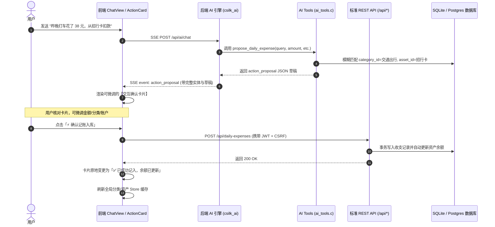

# Minefolio AI 助手全方位升级设计规范 (AI Assistant Comprehensive Upgrade Design Spec)

- **创建日期**：2026-08-27
- **状态**：已批准 (Approved)
- **文档路径**：`docs/superpowers/specs/2026-08-27-ai-assistant-comprehensive-upgrade-design.md`

---

## 1. 概述与设计目标

为了将 Minefolio 的 AI 财务助手从单一的“对话与只读查询工具”升级为“**兼具深度财务诊断、自然语言闭环记账与富交互体验的智能财务管家**”，本方案实施以下三大核心能力升级：

1. **智能记账与操作工具链（Action Tools & Two-Step Confirmation）**：
   - AI 能够理解自然语言记账与转账意图，智能模糊匹配用户现有的分类与资产账户；
   - 采用**客户端安全确认架构**：AI 输出拟录入草稿，前端渲染可编辑的【交互确认卡片】，用户确认后才真正调用成熟 REST API 入库，彻底消除幻觉误写。
2. **深度财务分析与体检体系（Financial Insights & Health Diagnosis）**：
   - 内置全套核心财务体检模型：应急备用金流动性月数、净储蓄率、资产负债率、生息投资资产占比、股债风险偏离度；
   - 一键生成结构化体检报告与资产配置再平衡建议。
3. **聊天交互与 UX 升级（Rich UI & Starters）**：
   - 场景化快捷引导气泡（Prompt Starters），降低新用户使用门槛；
   - 交互式 Action 状态卡片（待确认、已入库、已取消）；
   - 对话记录一键导出为 Markdown 与复制分享功能。

---

## 2. 系统架构与数据流图



---

## 3. 后端 AI Tools 详细规范

### 3.1 `propose_daily_expense` (日常收支拟录入草稿)
- **描述**：识别日常消费或收入意图，模糊匹配用户现有的资产和分类，生成拟录入草稿供前端确认。
- **参数 Schema**：
  ```json
  {
    "type": { "type": "string", "enum": ["expense", "income"], "description": "收支类型" },
    "amount": { "type": "number", "description": "金额 (必须 > 0)" },
    "category_name": { "type": "string", "description": "分类名称或意图，如餐饮、打车、工资" },
    "asset_name": { "type": "string", "description": "扣款或收款账户名称，如招行、微信、现金" },
    "date": { "type": "string", "description": "交易日期 YYYY-MM-DD，若未指明则默认为今天" },
    "note": { "type": "string", "description": "备注说明" }
  }
  ```
- **输出格式**：
  ```json
  {
    "action_type": "daily_expense",
    "status": "proposed",
    "data": {
      "type": "expense",
      "amount": 38.0,
      "category_id": 12,
      "category_name": "交通出行",
      "asset_id": 3,
      "asset_name": "招商银行卡",
      "date": "2026-08-26",
      "note": "昨晚打车"
    }
  }
  ```

### 3.2 `propose_transfer` (转账拟录入草稿)
- **描述**：识别账户间转账意图，匹配源账户与目标账户，生成拟录入草稿供前端确认。
- **参数 Schema**：
  ```json
  {
    "amount": { "type": "number", "description": "转账金额 (必须 > 0)" },
    "from_asset_name": { "type": "string", "description": "转出账户名称" },
    "to_asset_name": { "type": "string", "description": "转入账户名称" },
    "date": { "type": "string", "description": "日期 YYYY-MM-DD" },
    "fee": { "type": "number", "description": "手续费 (可选)" },
    "note": { "type": "string", "description": "转账备注" }
  }
  ```
- **输出格式**：
  ```json
  {
    "action_type": "transfer",
    "status": "proposed",
    "data": {
      "amount": 5000.0,
      "from_asset_id": 1,
      "from_asset_name": "工商银行",
      "to_asset_id": 3,
      "to_asset_name": "招商银行卡",
      "date": "2026-08-27",
      "fee": 0.0,
      "note": "还信用卡"
    }
  }
  ```

### 3.3 `analyze_financial_health` (财务健康度全景诊断)
- **描述**：聚合用户的资产负债、月均支出、储蓄情况，计算核心财务健康体检指标。
- **计算逻辑**：
  1. **流动性月数** = $\frac{\text{现金与活期资产总值}}{\max(\text{近3个月月均支出}, 1)}$
  2. **月度净储蓄率** = $\frac{\text{本月收入} - \text{本月支出}}{\max(\text{本月收入}, 1)} \times 100\%$
  3. **资产负债率** = $\frac{\text{总负债}}{\max(\text{总资产}, 1)} \times 100\%$
  4. **生息投资资产占比** = $\frac{\text{股票+基金+理财}}{\max(\text{总资产}, 1)} \times 100\%$
- **输出格式**：
  ```json
  {
    "metrics": {
      "liquidity_months": 5.2,
      "liquidity_status": "healthy",
      "savings_rate_pct": 34.5,
      "debt_to_asset_pct": 18.2,
      "invest_asset_pct": 52.0
    },
    "summary": {
      "total_assets": 125000.0,
      "total_liabilities": 22750.0,
      "net_worth": 102250.0,
      "monthly_inflows": 15000.0,
      "monthly_outflows": 9825.0
    },
    "evaluation_rules": {
      "liquidity_target": "3~6个月支出",
      "savings_rate_target": ">=30%",
      "debt_safe_line": "<=40%"
    }
  }
  ```

---

## 4. 前端交互与组件设计

### 4.1 交互确认卡片组件 (`ActionCard.vue`)
- **位置**：`frontend/src/components/ActionCard.vue`
- **支持的操作类型**：`daily_expense`（日常收支）、`transfer`（转账）；
- **卡片字段组件**：
  - 金额：`ElInputNumber` (格式化货币，支持步长)
  - 分类：`ElSelect` (从 `useCategoryStore` 动态加载树形/扁平分类列表)
  - 账户：`ElSelect` (从资产接口动态拉取用户的银行卡/现金资产列表，并附带当前余额提示)
  - 日期：`ElDatePicker`
  - 备注：`ElInput`
- **卡片状态机**：
  - `pending` (待确认)：可自由编辑，展示「确认记账」与「取消」按钮；
  - `executing` (入库中)：按钮 loading 动画，禁用表单；
  - `executed` (已入库)：表单变为只读，显示绿色成功 Badge 及“已成功入库并同步账户余额”；
  - `cancelled` (已取消)：灰色只读状态。

### 4.2 快捷引导气泡组件 (`PromptStarters.vue`)
- **位置**：`frontend/src/components/PromptStarters.vue`
- **内容配置**：
  1. 🛡️ **财务健康体检**：自动填充并发送 *“请对我的资产、负债、流动性与储蓄率做一次全面体检”*
  2. ⚡ **快捷记账**：自动填充 *“今天午餐消费 35 元，从微信钱包扣款”*
  3. 📊 **本月收支洞察**：自动填充 *“分析我本月的收支结构，指出支出最高的前三项”*
  4. 📈 **定投复利测算**：自动填充 *“每月定投 3000 元，年化收益率 8%，10 年后复利本息是多少？”*
  5. 💱 **实时汇率查询**：自动填充 *“查询今日美元、欧元、日元兑人民币的实时汇率”*

### 4.3 聊天记录导出功能
- 在 `ChatView.vue` 头部操作栏增加 **「📥 导出 Markdown」** 和 **「📋 复制全文」** 按钮；
- 导出算法自动将当前会话中的用户问题、AI 回答、结构化卡片与体检报告整合为 GitHub 风格 Markdown 文档，支持以 `Minefolio-Chat-YYYY-MM-DD.md` 命名下载。

---

## 5. 安全性与容错机制

1. **绝对权限隔离**：
   - 所有的实际入库请求由前端携带用户的标准 JWT Token 发起，受到后端的 CSRF 中间件、JWT 鉴权中间件及权限校验的全程保护；
   - AI 服务自身无直接写库权限，杜绝 Prompt 注入导致的越权写库。
2. **状态持久化与防重复提交**：
   - 卡片在确认中（`executing`）与确认后（`executed`）自动锁定禁用按钮，防止多次点击导致重复扣款。
3. **模糊匹配容错**：
   - 后端在匹配分类与账户时，若用户提到的账户（如“招行”）未完全匹配全称（“招商银行储蓄卡”），采用 `LIKE '%...%'` 模糊查找；若无任何匹配，默认选中用户的第一个可用资产并在前端卡片中提示用户核对。

---

## 6. 测试与验收标准

1. **AI Tools 单元与集成测试**：
   - `propose_daily_expense` 正确匹配现有资产与分类 ID；
   - `propose_transfer` 正确匹配源账户与目标账户；
   - `analyze_financial_health` 正确计算流动性月数、净储蓄率和负债率；
2. **全量集成测试**：
   - 运行 `./tests/test_link.sh` 确保全部 114 个既有测试用例保持 100% 通过（PASS=114, FAIL=0）；
3. **前端端到端体验验证**：
   - 空会话下展示快捷 Prompt Starters 且一键可发；
   - 对话输入“打车 20 元”能正确生成 ActionCard；
   - 点击「确认记账」后，日常收支表新增一条记录，关联资产余额扣减 20 元；
   - 点击右上角「导出 Markdown」能正确下载对话文档。
