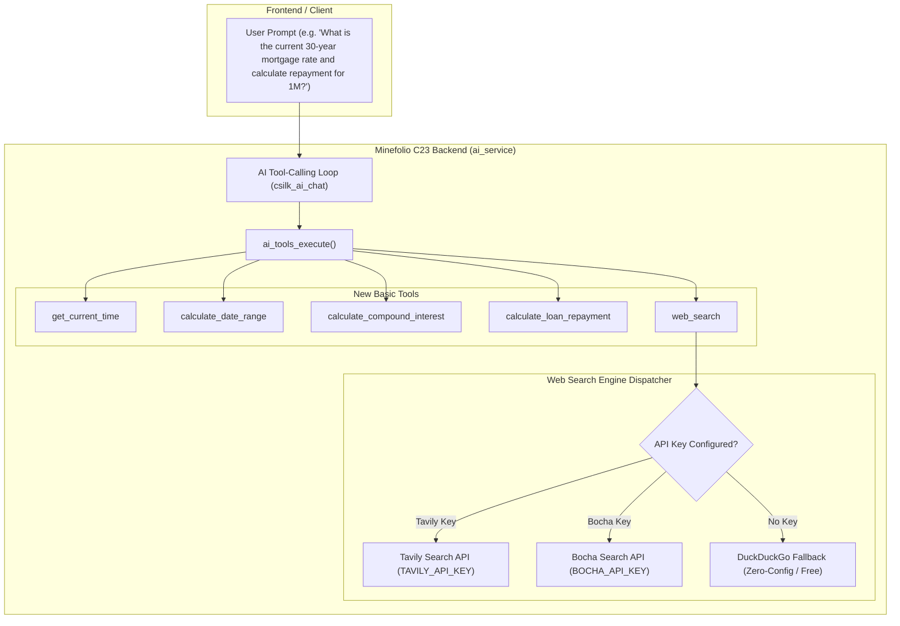

# Design Spec: AI Basic Tools Expansion (Time, Financial Calculators & Web Search)

## 1. Overview & Objectives

Minefolio features an AI assistant powered by `csilk_ai` with tool-calling capabilities. Currently, the backend (`backend/src/services/ai_tools.c`) provides 6 entity-query tools (`get_assets`, `get_asset_detail`, `get_transactions`, `get_daily_expenses`, `get_categories`, `get_summary`).

This specification expands the AI toolset with **5 fundamental general-purpose and financial utility tools**:
1. `get_current_time`: Precise current datetime, timezone, weekday, and quarter.
2. `calculate_date_range`: Natural language date range resolution (`this_month`, `last_week`, `last_30_days`, etc.).
3. `calculate_compound_interest`: High-precision regular investment & savings compound interest calculator.
4. `calculate_loan_repayment`: Mortgage & loan repayment schedule calculator (Equal Installment & Equal Principal).
5. `web_search`: Live web search with intelligent multi-provider fallback (Tavily, Bocha, DuckDuckGo).

---

## 2. Architecture & Execution Flow



---

## 3. Tool Specifications & Schemas

### 3.1 `get_current_time`

- **Purpose**: Supplies current server time, date, weekday, quarter, and timezone to eliminate model temporal hallucinations.
- **Parameters**:
  - `timezone` (string, optional): Desired timezone string (default: server local timezone).
- **Output Schema**:
  ```json
  {
    "datetime": "2026-08-27 07:35:00",
    "date": "2026-08-27",
    "time": "07:35:00",
    "year": 2026,
    "month": 8,
    "day": 27,
    "weekday": "Thursday",
    "weekday_cn": "星期四",
    "quarter": "Q3",
    "timezone": "Asia/Shanghai (UTC+8)",
    "timestamp": 1787787300
  }
  ```

---

### 3.2 `calculate_date_range`

- **Purpose**: Converts natural relative time phrases into strict `YYYY-MM-DD` start and end dates.
- **Parameters**:
  - `range_type` (string, required): One of `today`, `yesterday`, `this_week`, `last_week`, `this_month`, `last_month`, `this_quarter`, `last_quarter`, `this_year`, `last_year`, `last_7_days`, `last_30_days`, `last_90_days`, `last_365_days`.
- **Output Schema**:
  ```json
  {
    "range_type": "last_month",
    "label": "上个月",
    "start_date": "2026-07-01",
    "end_date": "2026-07-31",
    "days_count": 31
  }
  ```

---

### 3.3 `calculate_compound_interest`

- **Purpose**: Calculates compound growth for initial principal plus optional regular periodic contributions.
- **Parameters**:
  - `principal` (number, required): Initial principal amount in currency units.
  - `regular_contribution` (number, optional, default 0): Amount contributed each period.
  - `contribution_frequency` (string, optional, default `"monthly"`): `"monthly"` or `"yearly"`.
  - `annual_rate_pct` (number, required): Expected annual return percentage (e.g. `6.5` for 6.5%).
  - `years` (number, required): Investment duration in years.
- **Output Schema**:
  ```json
  {
    "total_principal": 600000.00,
    "total_interest": 453912.45,
    "future_value": 1053912.45,
    "effective_total_return_pct": 75.65,
    "yearly_summary": [
      { "year": 1, "principal": 120000.00, "balance": 124290.00, "interest": 4290.00 },
      { "year": 5, "principal": 600000.00, "balance": 1053912.45, "interest": 453912.45 }
    ]
  }
  ```

---

### 3.4 `calculate_loan_repayment`

- **Purpose**: Amortization calculator for loans and mortgages supporting both Equal Installment (等额本息) and Equal Principal (等额本金).
- **Parameters**:
  - `loan_amount` (number, required): Total loan amount in currency units.
  - `annual_rate_pct` (number, required): Annual interest rate percentage (e.g. `3.45` for 3.45%).
  - `term_years` (number, optional): Loan duration in years (e.g. `30`).
  - `term_months` (number, optional): Loan duration in months (takes precedence over `term_years`).
  - `repayment_type` (string, required): `"equal_installment"` or `"equal_principal"`.
- **Output Schema**:
  ```json
  {
    "loan_amount": 1000000.00,
    "repayment_type": "equal_installment",
    "term_months": 360,
    "monthly_payment": 4462.58,
    "total_interest": 606528.80,
    "total_repayment": 1606528.80,
    "first_month_payment": 4462.58,
    "last_month_payment": 4462.58
  }
  ```

---

### 3.5 `web_search`

- **Purpose**: Real-time web retrieval for market data, news, benchmark rates, and macroeconomic trends.
- **Parameters**:
  - `query` (string, required): Search query keywords or question.
  - `max_results` (integer, optional, default 5): Maximum number of search results (1-10).
- **Provider Hierarchy**:
  1. `TAVILY_API_KEY` (Tavily Search API `https://api.tavily.com/search`).
  2. `BOCHA_API_KEY` (Bocha AI Search API `https://api.bochaai.com/v1/web-search`).
  3. Fallback: DuckDuckGo Lite Search / API (zero-config, keyless HTTP request).
- **Output Schema**:
  ```json
  {
    "query": "2026最新房贷利率",
    "provider": "tavily",
    "results_count": 3,
    "results": [
      {
        "title": "2026年商业性个人住房贷款加权平均利率政策公布",
        "url": "https://example.com/news/1",
        "snippet": "中国人民银行最新公布全国房贷利率平均水平为...",
        "published_date": "2026-08-20"
      }
    ]
  }
  ```

---

## 4. Implementation Details

### 4.1 C Code Structure
- **Modified files**:
  - `backend/src/services/ai_tools.h`: Tool definition declarations and execution header.
  - `backend/src/services/ai_tools.c`:
    - Schemas: `schema_get_current_time()`, `schema_calculate_date_range()`, `schema_calculate_compound_interest()`, `schema_calculate_loan_repayment()`, `schema_web_search()`.
    - Handlers: `exec_get_current_time()`, `exec_calculate_date_range()`, `exec_calculate_compound_interest()`, `exec_calculate_loan_repayment()`, `exec_web_search()`.
    - Registered in `s_tools[]` and dispatched in `ai_tools_execute()`.

### 4.2 Error Handling & Resilience
- All mathematical formulas validate edge conditions (e.g. `rate == 0`, `term_months <= 0`, `loan_amount <= 0`).
- Web search enforces an 8-second HTTP timeout using `CURLOPT_TIMEOUT_MS` to prevent hanging the chat stream.
- Web search handles JSON serialization errors gracefully with structured error envelopes.

---

## 5. Verification Plan

1. **Backend Integration Tests**:
   - Write standalone test cases verifying all 5 tool executions in `backend/tests/`.
   - Verify leap year calculations, negative/zero rate handling, and amortization accuracy against known financial standards.
2. **AI Dialogue End-to-End Tests**:
   - Verify tool invocation in live chat for time queries, compound interest queries, mortgage queries, and web searches.
