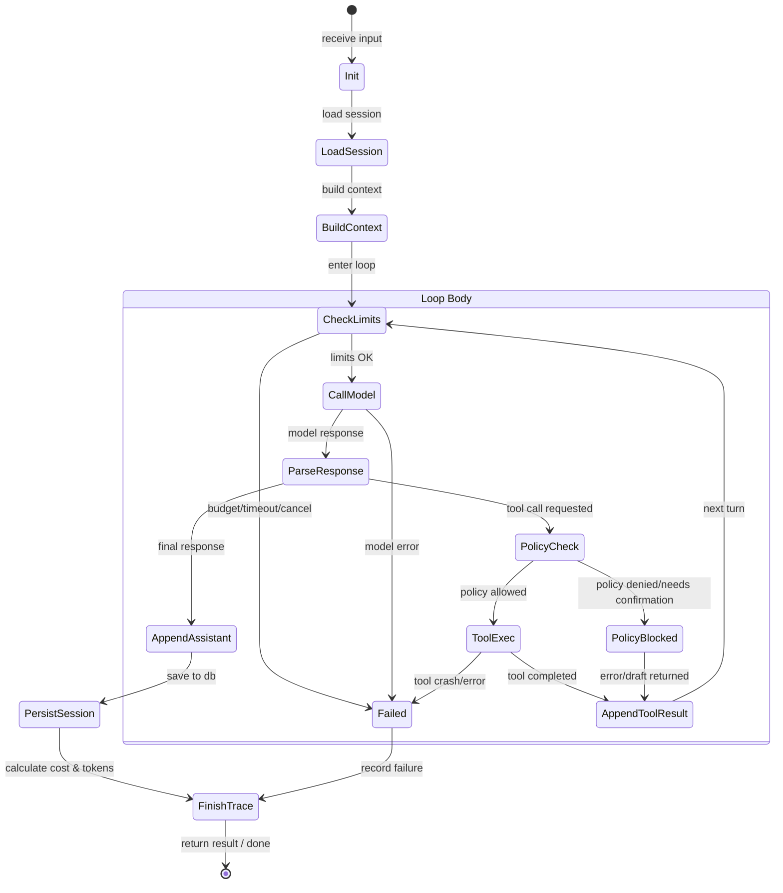

# Minefolio P1-05: 统一 AI Runtime 架构设计规范

- **状态**: 已确认 (Approved)
- **创建日期**: 2026-09-04
- **作者**: Minefolio 核心团队

---

## 1. 目标与背景

在当前 Minefolio 架构中，Controller (`ai_controller.c`)、Service (`ai_service.c`) 以及部分工作流 (`ai_workflow_service.c` / `workflow/executor.c`) 存在直接操作底层 LLM 驱动 (`csilk_ai_t` / `csilk_ai_chat`)、硬编码会话和消息循环逻辑的情况。这种设计导致：
1. **职责耦合**：HTTP 处理层混合了流式协议、LLM 重试、工具分发和安全策略判定；
2. **缺乏统一风控**：没有集中式 Token 预算、费用预算、工具调用次数限制及超时熔断机制；
3. **错误语义模糊**：底层异常易被退化为泛化错误码，调用方难以区分模型错误、工具错误或策略拦截；
4. **扩展受限**：新增工作流或智能代理时，无法复用完整的 Agent 循环与记忆机制。

**本设计旨在建立 Minefolio 专属的统一 AI Runtime，彻底解耦 Controller、Workflow 与底层 LLM 调用，提供可控、健壮、模块化、具备完整链路追踪的 Agent 执行引擎。**

---

## 2. 运行时系统分层架构

统一 AI Runtime 组织结构如下：

```text
AI Runtime
├── Session       (会话持久化与状态管理)
├── Context       (统一运行时上下文容器)
├── Model         (大模型调用与多供应商适配)
├── Tool          (工具注册、寻址与参数校验)
├── Workflow      (高级业务工作流编排集成)
├── Policy        (鉴权、风控评定与二次确认流水线)
├── Trace         (全链路监控、Span与成本核算)
└── Memory        (滑动窗口与工作记忆管理)
```

### 2.1 模块职责与依赖方向

```text
              [HTTP Controllers]       [AI Workflows]
                       │                      │
                       └───────────┬──────────┘
                                   │
                                   ▼
                       ┌───────────────────────┐
                       │      AI Runtime       │
                       │ (runtime.h / loop.h)  │
                       └───────────┬───────────┘
                                   │
       ┌───────────┬───────────────┼───────────────┬───────────┐
       ▼           ▼               ▼               ▼           ▼
  ┌─────────┐ ┌─────────┐     ┌─────────┐     ┌─────────┐ ┌─────────┐
  │ Session │ │ Memory  │     │ Limits  │     │  Model  │ │  Trace  │
  └────┬────┘ └─────────┘     └─────────┘     └────┬────┘ └─────────┘
       │                                           │
  ┌────▼────┐                                 ┌────▼────┐
  │ ai_repo │                                 │ csilk_ai│
  └─────────┘                                 └─────────┘
                                   │
                                   ▼
                             ┌───────────┐
                             │   Tool    │
                             └─────┬─────┘
                                   ▼
                             ┌───────────┐
                             │  Policy   │ (风控/鉴权/确认/审计)
                             └───────────┘
```

1. **Session (`services/ai/runtime/session.h/.c`)**：
   - 负责与数据库存储打交道，封装会话创建、查询、自动标题生成与截断、消息持久化。
2. **Context (`services/ai/runtime/context.h/.c`)**：
   - 统一承载运行时状态结构体 `ai_runtime_context_t`，避免各层零散传递参数。
3. **Memory (`services/ai/memory/memory.h/.c`)**：
   - 维护会话记忆滑动窗口（Sliding Window）及短时工作记忆；
   - 支持根据模型上下文窗口及 Token 预算对历史消息进行智能截断，保证 System 提示词不被丢弃。
4. **Limits & Budgets (`services/ai/runtime/limits.h/.c`)**：
   - 统一管理循环预算：最大迭代轮数、超时限制、Token 预算、工具调用次数预算、成本限额、主动取消标记。
5. **Model (`services/ai/model/`)**：
   - 抽象底层驱动调用 (`csilk_ai_chat`)，统一请求参数序列化与响应结构化解析。
6. **Tool & Policy (`services/ai/tools/` & `services/ai/policy/`)**：
   - 工具严禁直接调用 LLM；所有工具调用必须先过 Policy 管道（鉴权、频次检查、风险评定、二次确认草案拦截）。
7. **Trace (`services/ai/trace/`)**：
   - 自动记录 Session 级 Trace、模型请求耗时、Token/费用估算、工具调用 Span，最终落库。
8. **Workflow (`services/ai/workflow/`)**：
   - 工作流执行器作为 AI Runtime 的上层调用方，通过 Runtime 接口驱动 LLM 报告生成和复杂任务，不再自建循环。

---

## 3. Agent Loop 核心循环与状态转移

统一 Agent 循环生命周期严格遵循如下序列：

```text
receive input
     ↓
load session
     ↓
build context
     ↓
┌──────────────────────────────────────┐
│ loop:                                │
│   1. check limits & budgets / cancel │
│   2. call model                      │
│   3. parse response                  │
│   4. if final text -> break loop     │
│   5. if tool calls:                  │
│        check tool budget             │
│        evaluate tool policy          │
│        execute tool (or fail/confirm)│
│        append tool result            │
│        continue loop                 │
└──────────────────────────────────────┘
     ↓
append final result to session
     ↓
finish trace & persist
     ↓
finish
```

### 3.1 状态转移图 (Mermaid)



---

## 4. 数据结构规范

### 4.1 统一 Runtime 上下文 (`ai_runtime_context_t`)

```c
typedef struct {
    /* 用户与权限 */
    int64_t               user_id;
    ai_permission_level_t perm_level;

    /* 会话标识 */
    int64_t               session_id;
    char                  session_title[128];

    /* 消息队列 */
    csilk_json_t*         messages;      /* [{"role":"system",...}, {"role":"user",...}] */

    /* 可用工具 */
    csilk_ai_tool_t*      tools;
    size_t                tool_count;

    /* 模型与超参 */
    char                  provider_id[64];
    char                  model_name[128];
    double                temperature;
    int                   max_tokens;
    double                top_p;

    /* 限制与度量统计 */
    ai_runtime_limits_t   limits;
    ai_runtime_stats_t    stats;
    volatile bool*        cancel_token;

    /* 扩展元数据与链路 */
    csilk_json_t*         metadata;
    ai_trace_t*           trace;
} ai_runtime_context_t;
```

### 4.2 限制与预算 (`ai_runtime_limits_t` & `ai_runtime_stats_t`)

```c
typedef struct {
    int     max_iterations;   /* 最大循环轮数，默认 10 */
    int64_t timeout_ms;       /* 总执行超时（毫秒），如 60000ms */
    int     token_budget;     /* 最大 Token 总预算 (prompt + completion) */
    int     tool_budget;      /* 最大工具调用次数，如 15 次 */
    double  cost_budget;      /* 最大总费用上限 (USD) */
} ai_runtime_limits_t;

typedef struct {
    int     iterations_done;  /* 已迭代轮数 */
    int     prompt_tokens;    /* 累计输入 Token */
    int     completion_tokens;/* 累计输出 Token */
    int     total_tokens;     /* 累计总 Token */
    int     tool_calls_count; /* 累计调用工具次数 */
    double  total_cost;       /* 累计估计费用 */
    int64_t elapsed_ms;       /* 运行时长 (毫秒) */
} ai_runtime_stats_t;
```

---

## 5. 错误体系分类 (Error Taxonomy)

严禁在 Runtime 中使用笼统的 `AI_ERROR`。严格定义枚举：

| 错误枚举值 | 错误码 | 含义说明 | 典型触发场景 |
|---|---|---|---|
| `AI_RUNTIME_ERR_OK` | 0 | 正常完成 | 成功获得最终输出 |
| `AI_RUNTIME_ERR_MODEL` | 1001 | 模型调用异常 | 服务商网络超时、HTTP 4xx/5xx、API Key 失效、服务商拒绝服务 |
| `AI_RUNTIME_ERR_TOOL` | 1002 | 工具执行异常 | 工具不存在、底层执行崩溃、返回无效非 JSON 内容 |
| `AI_RUNTIME_ERR_POLICY` | 1003 | 安全策略拒绝 | 越权调用、调用频次超限、单笔动账超额、需要二次确认未放行 |
| `AI_RUNTIME_ERR_TIMEOUT` | 1004 | 执行超时超轮 | 耗时超过 `timeout_ms`，或循环迭代次数超出 `max_iterations` |
| `AI_RUNTIME_ERR_CONTEXT_OVERFLOW` | 1005 | 记忆/预算超限 | 累计 Token 超出 `token_budget`，或费用超 `cost_budget` |
| `AI_RUNTIME_ERR_VALIDATION` | 1006 | 请求校验失败 | `user_id` 非法、`content` 为空、工具参数 Schema 校验失败 |
| `AI_RUNTIME_ERR_CANCELLED` | 1007 | 操作主动取消 | `cancel_token` 被置为 true，终止后续循环 |

结构体规范：
```c
typedef struct {
    ai_runtime_error_t code;
    char               message[256];
    char               detail[512];
} ai_runtime_status_t;

const char* ai_runtime_error_name(ai_runtime_error_t code);
```

---

## 6. 对外 API 接口

### 6.1 流式/事件驱动模式 (`ai_runtime_execute_stream`)
专供 SSE 控制器和长文本流式工作流使用：

```c
typedef struct {
    void (*on_text_chunk)(const char* chunk, void* udata);
    void (*on_tool_call)(const char* id, const char* name, const char* args_json, void* udata);
    void (*on_tool_result)(const char* id, const char* name, const char* result_json, void* udata);
    void (*on_error)(const ai_runtime_status_t* status, void* udata);
    void (*on_done)(const ai_runtime_stats_t* stats, void* udata);
} ai_runtime_callbacks_t;

ai_runtime_status_t ai_runtime_execute_stream(
    csilk_db_pool_t*              pool,
    ai_runtime_context_t*         ctx,
    const ai_runtime_callbacks_t* cbs,
    void*                         user_data
);
```

### 6.2 阻塞/同步模式 (`ai_runtime_execute`)
专供离线任务、批处理和自动化测试使用：

```c
typedef struct {
    char*               final_content;  /* 最终输出文本 (需调用方 free) */
    ai_runtime_status_t status;
    ai_runtime_stats_t  stats;
} ai_runtime_result_t;

ai_runtime_result_t ai_runtime_execute(
    csilk_db_pool_t*      pool,
    ai_runtime_context_t* ctx
);
```

---

## 7. 现有模块重构与解耦计划

1. **`ai_service.c` 瘦身**：
   - `ai_chat_handler`：只负责解析 HTTP 参数、组装 `ai_runtime_context_t` 与 `ai_runtime_callbacks_t`（封装 SSE 事件发送），直接委托 `ai_runtime_execute_stream`。
   - `ai_service_stream_report`：同样将工作流提示词和结构化上下文委托给 `ai_runtime_execute_stream`。
2. **`workflow/executor.c` 解耦**：
   - 替换对 `ai_service_stream_report` 的依赖，统一使用 Runtime 接口。
3. **`tools/` 纯净化**：
   - 确保工具实现无任何对 LLM 客户端的依赖。

---

## 8. 测试策略与验收指标

1. **单元测试 (`tests/unit/test_ai_runtime.c`)**：
   - **预算与超限测试**：覆盖 `max_iterations`, `timeout_ms`, `token_budget`, `tool_budget`, `cost_budget`, `cancel_token` 场景下的精准中断与状态码校验。
   - **错误分类覆盖**：验证全部 7 种非 OK 错误枚举的触发与描述生成。
   - **Memory 滑动窗口**：验证在不同 context_size 下对消息数组的保留与截断逻辑。
2. **现有回归测试**：
   - 确保 26 个现有 CTest 测试全部 100% 通过。
   - 运行 `./tests/test_ai_trace.sh` 确保链路追踪兼容。
   - 运行 `./tests/test_link.sh` 确保系统端到端验证通过。
