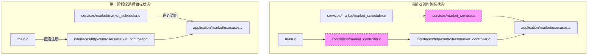

# Minefolio 双架构绞杀第一阶段：建立 test_full.sh 门禁与 Market 领域绞杀设计规范

## 1. 背景与目标

在 Minefolio 历经多轮领域驱动设计（DDD）与分层架构演进后，当前代码库处于**双架构并存（Dual-Architecture）**的过渡状态：
1. **DDD 新分层**：
   - `backend/src/interfaces/http/controllers/`（HTTP 表现层）
   - `backend/src/application/`（应用服务用例层）
   - `backend/src/domain/`（领域模型与规则层）
   - `backend/src/infrastructure/`（仓储实现与底层适配）
2. **Legacy 遗留层**：
   - `backend/src/controllers/`
   - `backend/src/services/`
   - `backend/src/repositories/`

双架构并存带来了明显的认知负担、维护开销以及潜在的死代码/绕行风险。为了稳妥、渐进地消除遗留架构，我们采用**绞杀者模式（Strangler Fig Pattern）**：
- **按域逐个击破**；
- **以全量功能测试 `test_full.sh` 为统一质量门禁**；
- 每次下线一个领域的遗留 `controllers/*` 与 `services/*`，并完成物理删除。

### 第一阶段目标
1. **对齐与修复 `backend/tests/test_full.sh`**：将其修复至 **100% 通过（153+ 断言 0 失败）**，成为后续所有领域绞杀的可靠一键回归门禁。
2. **彻底绞杀 `market` 领域遗留 Facade**：
   - `backend/src/main.c` 改为直连 `interfaces/http/controllers/market_controller.h`。
   - `backend/src/services/market/market_scheduler.c` 改为直连 `application/market/usecases.h` 中的 `market_usecase_do_sync_user()`。
   - **物理删除** 4 个冗余文件：
     - `backend/src/controllers/market_controller.h`
     - `backend/src/controllers/market_controller.c`
     - `backend/src/services/market_service.h`
     - `backend/src/services/market_service.c`
3. **完成质量门禁全量验证**：`test_full.sh` + `test_market_sync.sh` + 26 个 CTest 套件 + `test_link.sh` + 前端编译全绿。

---

## 2. 架构演进与绞杀策略 (Strangler Fig Pattern)

### 2.1 当前 Market 领域现状
在当前代码库中，`market` 领域的完整业务逻辑和 HTTP 处理实际上已经全部在 DDD 层就绪：
- `interfaces/http/controllers/market_controller.c` 实现了行情搜索、获取报价、手动/批量同步、汇率维护等所有 REST 端点。
- `application/market/usecases.c` 实现了核心应用用例。
- 现存的 `controllers/market_controller.c` 和 `services/market_service.c` 仅仅是 10 余行的空壳转发器（Facade），仅被 `main.c` 注册路由以及 `services/market/market_scheduler.c` 调度调用。



### 2.2 变迁步骤与边界保障
1. 将 `backend/src/main.c` 中的引用由 `#include "controllers/market_controller.h"` 替换为 `#include "interfaces/http/controllers/market_controller.h"`。
2. 将 `backend/src/services/market/market_scheduler.c` 中的引用由 `#include "services/market_service.h"` 替换为 `#include "application/market/usecases.h"`，并将 `market_service_do_sync_user` 直接调用替换为 `market_usecase_do_sync_user`。
3. 删除 `backend/src/controllers/market_controller.{c,h}` 与 `backend/src/services/market_service.{c,h}`。
4. 由于 `backend/CMakeLists.txt` 采用 `file(GLOB_RECURSE SOURCES "src/*.c")`，文件删除后由 CMake 自动同步，无需手动维护编译源列表。

---

## 3. 质量门禁修复设计 (`backend/tests/test_full.sh`)

`test_full.sh` 目前有约 58 处断言失败，经过排查主要由测试脚本假设过时引起，需做针对性治理：

### 3.1 初始数据与分类名称冲突治理
- **问题**：系统首访初始化（`/system/setup`）时，后端会自动为新用户插入默认内置分类（如“餐饮”、“购物”、“交通”等）。`test_full.sh` 随后盲目创建同名分类，触发分类名唯一键约束冲突（`1004` 或 `1002`）。
- **解法**：
  - 测试创建自定义分类时，统一使用测试前缀（例如 `FT-餐饮`、`FT-工资`、`FT-工商银行` 等）；
  - 或者优先通过 `id_by_name` 或 API 获取既有分类 ID，若不存在再创建。统一保证测试用例独立无冲突。

### 3.2 数值比较鲁棒性 (`check_num` 算子)
- **问题**：目前使用纯字符串比较 `check "描述" "期望值" "实际值"`。当接口返回 JSON 浮点数如 `10000.0` 或 `10000.00` 时，与脚本中的期望字面量 `"10000"` 产生字面不匹配而误报失败。
- **解法**：
  - 在 `test_full.sh` 中增加专门的数值断言函数：
    ```bash
    check_num() {
      local desc="$1" expected="$2" actual="$3"
      local diff=$(awk -v e="$expected" -v a="$actual" 'BEGIN { d = e - a; if (d < 0) d = -d; print (d < 0.001) ? "1" : "0" }' 2>/dev/null || echo "0")
      if [ "$diff" = "1" ]; then
        PASS=$((PASS+1))
        echo "  ✅ $desc"
      else
        FAIL=$((FAIL+1))
        FAILED_CASES+=("$desc (期望 $expected 实际 $actual)")
        echo "  ❌ $desc (期望 $expected 实际 $actual)"
      fi
    }
    ```
  - 将金额、余额、资产净值等浮点/定点比较全面替换为 `check_num`。

### 3.3 路由路径与系统状态对齐
- **问题**：系统初始状态检查使用了 `/system/status`，而部分测试或系统端点在 `/api/system/setup` 状态查询上有细微差异。
- **解法**：核对与 `interfaces/http/controllers/system_controller.c` 的真实路由定义，统一采用标准 REST 端点路径。

### 3.4 动态 ID 传递与级联断言
- **问题**：当资产创建返回的 JSON 结构调整，或提取 ID 失败导致下游交易使用空 ID 时，会引发连锁错误。
- **解法**：增强 ID 提取保护，在每步核心实体创建后验证其有效性，若失败立即记录诊断日志，避免级联雪崩。

---

## 4. Market 领域绞杀与物理清理规范

### 4.1 接口层路由注册直连
- 修改 `backend/src/main.c`：
  ```c
  // 原代码：
  // #include "controllers/market_controller.h"
  // 新代码：
  #include "interfaces/http/controllers/market_controller.h"
  ```
- 验证 `register_market_routes(app)` 的入参与签名完全一致。

### 4.2 调度器解耦
- 修改 `backend/src/services/market/market_scheduler.c`：
  ```c
  // 原代码：
  // #include "services/market_service.h"
  // ...
  // market_service_do_sync_user(g_pool, 0, &synced, &failed);

  // 新代码：
  #include "application/market/usecases.h"
  // ...
  market_usecase_do_sync_user(g_pool, 0, &synced, &failed);
  ```

### 4.3 物理清理列表
在构建确认无误后，删除以下 4 个遗留文件：
1. `backend/src/controllers/market_controller.h`
2. `backend/src/controllers/market_controller.c`
3. `backend/src/services/market_service.h`
4. `backend/src/services/market_service.c`

---

## 5. 验证矩阵与自动化门禁 (Verification Matrix & Quality Gate)

本次重构的验收执行严格的阶段性门禁检查：

| 验证层级 | 执行命令 / 脚本 | 预期结果 |
| :--- | :--- | :--- |
| **全量功能门禁** | `./tests/test_full.sh` | **100% 通过（153+ 断言 0 FAIL）** |
| **Market 领域专项** | `./tests/test_market_sync.sh` | **18 个测试用例全部通过** |
| **CTest 单元测试** | `cd build && ctest --output-on-failure` | **26 个测试套件全部通过** |
| **核心集成测试** | `./tests/test_link.sh` | **38 个测试用例（139 断言）全部通过** |
| **后端编译** | `cmake --build backend/build --parallel` | **0 警告，0 错误** |
| **前端编译** | `npm --prefix frontend run build` | **`vue-tsc -b` 0 错误，打包成功** |

---

## 6. 后续领域演进路线图 (Roadmap)

本阶段完成 Market 领域绞杀与 `test_full.sh` 门禁后，后续依次推进遗留领域的绞杀：
1. **Transaction / Daily Expense 领域**（核心记账、交易写入与查询、费用联动）；
2. **Asset / Portfolio 领域**（资产配置与收益统计）；
3. **Category / Tag 领域**（分类与标签树管理）；
4. **Auth / System / Ledger 空间领域**（空间隔离与多租户权限）；
5. **彻底下线 `src/controllers/` 与 `src/services/` 目录**，完成 DDD 单一架构统合。
